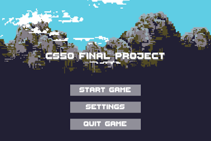
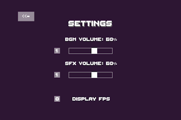

# CS50x Final Project 
#### Video Demo:  <https://youtu.be/e5vlkxsIVWo>
#### Description:

 

This project is a game made using [Lua](https://www.lua.org/) programming language and the [LÖVE](https://love2d.org/) framework. This game contains different states like Menu, Game, Setting, End, and Quit. These states indicate individual pages and designs for each of their game situation. 

I decided to make a game for my CS50x Final Project because I am interested in game development. The [Platform Game](https://en.wikipedia.org/wiki/Platformer) genre inspires me. Games like Little Big Planet, Super Mario Bros, and Cuphead motivated me to make a game. It is also a huge opportunity to learn new things, like Lua and LOVE2d. I also learned exciting things like game engines, game designs, and game genres during my exploration.

I use the Simple Tiled Implementation (STI) library and the [Tiled](https://www.mapeditor.org/) level editor for the game-level design. The player sprite movement was updated using the anim8 library. The sliders in the setting state are drawn using the simple-slider library. The image and sound effect assets used in-game were mostly free online assets. The details are in [CREDITS.md](CREDITS.md).

A simple graphical user interface ([GUI](https://en.wikipedia.org/wiki/Graphical_user_interface)) is in-game. The player can check it to be aware of their remaining lives and coins collected. Objects such as coins and obstacles are stored in metatables and will be updated when the player is in contact with them. The player aims to collect coins and avoid being hurt more than three times by the traps set around the map. 

The player can also access the setting state to adjust the game volume and enable [FPS/ Frame rate](https://en.wikipedia.org/wiki/Frame_rate) display. The player can pause during the game and access settings, back to the game, or the menu. To quit the game, the player can press the `QUIT GAME` button and confirm.

# How To Play Game
1. Download [LÖVE](https://love2d.org/)
1. Download the game file by: - Click the **green** `Code` button above -> `Local` -> `Download ZIP` and **extract** the zip file to any directory on your device **OR** - Execute `git clone https://github.com/xs1128/cs50x-final-project.git` command on the directory you wanted if **git is available**
1. Run it - Windows : Drag the file to `love.exe` or `lovec.exe` (can be a shortcut) inside the `LOVE` folder (From Step 1) - GNU/Linux and macOS : Please refer to [LOVE - Game Distribution](https://love2d.org/wiki/Game_Distribution)

# Rules
- The player has 3 lives at the start
- The player should aim to collect all the coins
- The player should avoid stepping on the traps set
- There are 3 levels

# Controls
- Movement -  `Right` and `Left` arrow keys to move horizontally || `Spacebar` to jump vertically ||
- Pause - `P` or `Esc` to pause the game (When the game level is running)

# Credits
- Please refer to [CREDITS.md](CREDITS.md)